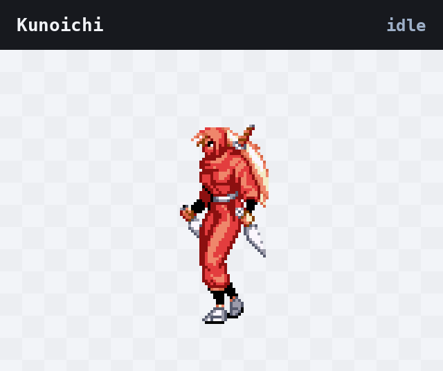
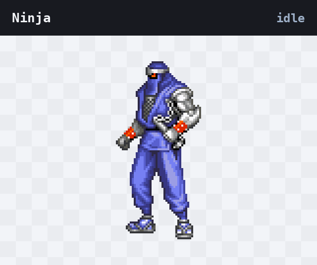
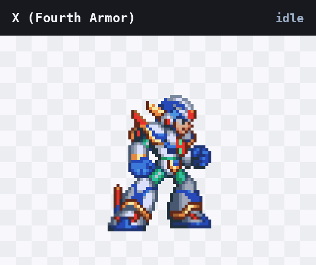
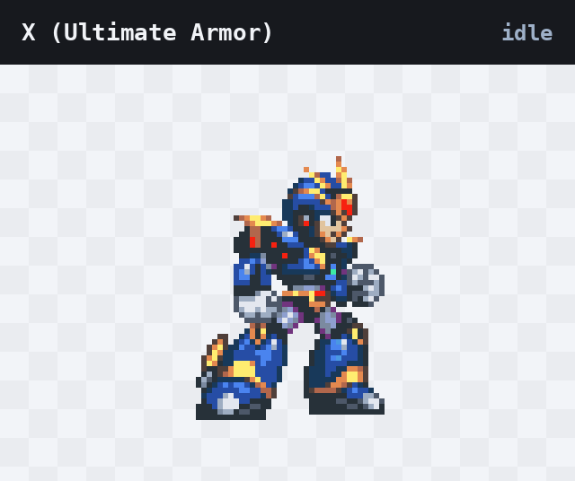

[English](README.md) | 简体中文

# Retro Codex Pets

四个像素风的 Codex 宠物，图案取自游戏原版 sprite：两位来自《The Ninja Warriors》的忍者机器人，以及《Mega Man X4》中 X 的两套装甲。每个都是完整的 V2 宠物包——待机、左右奔跑、挥手、跳跃、失败、等待、工作、检视，外加全部十六个注视方向——它会跟着 agent 的进度做反应，而不只是傻站着。

下面的预览就是宠物本身，逐帧时长与下方的表格一致。

## Kunoichi



绯红装甲的女忍者机器人，双持苦无。`nw-kunoichi` —— 《The Ninja Warriors》

## Ninja



重型钢铁机器人，前臂伸缩刀刃。`nw-ninja` —— 《The Ninja Warriors》

## X (Fourth Armor)



白金配色的空气动力装甲，等离子炮与悬浮靴。`x4-fourth-armor` —— 《Mega Man X4》

## X (Ultimate Armor)



紫罗兰装甲，金色羽翼头冠，究极冲击。`x4-ultimate-armor` —— 《Mega Man X4》

## 安装

```sh
curl -fsSL https://raw.githubusercontent.com/dncore/retro-codex-pets/main/install.sh | bash
```

这条命令会把四个宠物全部装进 `$CODEX_HOME/pets`（默认为 `~/.codex/pets`）。然后在 Codex 里打开 **Settings -> Appearance -> Pets** 选中你的宠物，输入 `/pet` 让它出场。

只装其中几个，或从本地仓库安装：

```sh
# 只装指定宠物
curl -fsSL https://raw.githubusercontent.com/dncore/retro-codex-pets/main/install.sh | bash -s nw-kunoichi x4-ultimate-armor

# 列出可用 id，或查看全部选项
curl -fsSL https://raw.githubusercontent.com/dncore/retro-codex-pets/main/install.sh | bash -s -- --list

# 从 clone 出来的仓库安装：直接复制本地文件，不下载
git clone https://github.com/dncore/retro-codex-pets && cd retro-codex-pets && ./install.sh
```

`CODEX_HOME` 指定 Codex 数据目录，`PET_REF` 指定从哪个分支或 tag 下载：

```sh
CODEX_HOME=/tmp/codex-test ./install.sh      # 装到别处
PET_REF=some-branch ./install.sh             # 指定分支，或 tag
```

安装脚本先下载到暂存目录，两个文件都到齐后才替换进去，所以网络中断不会给你留下半个宠物。卸载：

```sh
rm -rf "${CODEX_HOME:-$HOME/.codex}/pets/nw-ninja"
```

手动安装则是每个宠物两个文件：把 `pets/<id>/pet.json` 和 `pets/<id>/spritesheet.webp` 复制到 `~/.codex/pets/<id>/` 即可。

## 宠物包里有什么

宠物包是以 id 命名的目录，里面有一个 `pet.json` 清单和一张精灵图。这里四个宠物都是 **精灵版本 2**（V2），也就是引入了注视姿态的那版图集格式。

```json
{
  "id": "nw-kunoichi",
  "displayName": "Kunoichi",
  "description": "Kunoichi (クノイチ) - agile female ninja android from The Ninja Warriors, sleek crimson armor with dual kunai blades and deadly acrobatic combat.",
  "spriteVersionNumber": 2,
  "spritesheetPath": "spritesheet.webp"
}
```

精灵图为 `1536x2288` 的无损 WebP，每个 28-40 KB——比一张截图还小。每张是 8 列 11 行的网格，单元格 `192x208`：

| 行 | 轨道 | 帧数 | 逐帧时长 | 含义 |
|----:|-------|-------:|--------------------|---------------|
| 0 | idle | 6 (+1 注视) | 280, 110, 110, 140, 140, 320 ms | 待机呼吸 |
| 1 | running-right | 8 | 120 ms，末帧 220 ms | 向右移动 |
| 2 | running-left | 8 | 120 ms，末帧 220 ms | 向左移动 |
| 3 | waving | 4 | 140 ms，末帧 280 ms | 打招呼 |
| 4 | jumping | 5 | 140 ms，末帧 280 ms | 起跳落地 |
| 5 | failed | 8 | 140 ms，末帧 240 ms | 出错了 |
| 6 | waiting | 6 | 150 ms，末帧 260 ms | 卡在等你 |
| 7 | running | 6 | 120 ms，末帧 220 ms | 任务进行中 |
| 8 | review | 6 | 150 ms，末帧 280 ms | 检视已完成的工作 |
| 9-10 | look | 8 + 8 | 不计时 | 十六个注视姿态，从正上方起顺时针每 22.5° 一个 |

自己画宠物时需要注意的几点：

- **第 0 行的第 6、7 列不属于待机循环。** 按下方 skill 的说法，第 6 列存放正面注视中立姿态（供光标注视算法回正使用），第 7 列必须完全透明；这四个宠物都填了第 6 列、留空第 7 列。而 agent-pet-runtime 的校验器把这两列都算作富余列——里面有内容只给警告、不报错，而且那里的像素不会进入播放。
- **注视行是姿态，不是动画。** Codex 根据指针角度挑一格，所以预览里替你把十六格扫了一遍。
- **待机用的是原始时长。** Codex 自己的表把这六个时长整体乘以六，把一次呼吸拉得极慢；预览 GIF 用的是原始时长。
- **挥手、跳跃、失败、检视是一次性的“瞬间”。** 它们把整行播几遍，然后回到待机。等待和两个奔跑行是“状态”，只要状态还在就一直循环。

## 重新生成预览

```sh
python3 -m pip install pillow numpy
python3 tools/make_previews.py                      # 生成 previews/<id>.gif
python3 tools/make_previews.py --scale 3 --background paper
```

生成脚本读取每个宠物包自己的清单和精灵图，按上表时长播放，并在棋盘格上以 2 倍最近邻放大合成卡片，方便看清透明区域。可用参数：`--pets-dir`、`--out-dir`、`--pets`、`--scale`、`--background {checker,paper,ink}`。

每个预览都会在 GIF 注释里记录它依据的图集 SHA-256，CI 会拿它和实际随包发布的图集比对。预览落后于精灵图时会直接检查失败，而不会被发布出去。

## 用别的 sprite 做自己的宠物

[`skills/sprite-to-codex-pet/`](skills/sprite-to-codex-pet/) 就是制作这些宠物所用的 agent skill，与宠物一起开源在这里。把游戏机原版 sprite、MUGEN 图包或你自己的像素画交给它，它会带 agent 走完整个流程：抠背景时不误伤角色自身的配色、从原图切出帧、整数倍最近邻缩放、逐帧解剖学锚定（消除抖动）、判断原图里哪几帧是招手哪几帧是失败、合成原图没有的姿态、最后装配图集。

随附 v2 图集规范、16 条踩坑经验与解决方案，以及四个脚本——图集体检、去底清洗、快速校验、循环预览生成：

```sh
git clone https://github.com/dncore/retro-codex-pets /tmp/rp
cp -R /tmp/rp/skills/sprite-to-codex-pet ~/.claude/skills/     # 或 ~/.gemini/config/skills/
python3 -m pip install pillow numpy
python3 ~/.claude/skills/sprite-to-codex-pet/scripts/pet_doctor.py path/to/spritesheet.webp
```

各脚本的用途、以及它的抖动指标唯一会误导你的地方，见 [skill 的 README](skills/sprite-to-codex-pet/README.md)。

## 版权与致谢

本项目的精灵图取自其描绘的游戏原版 sprite：《The Ninja Warriors》（Taito）与《Mega Man X4》（Capcom）。角色、设定、原始 sprite 与名称均归各自所有者所有。本项目不主张任何原创美术，也不主张对上述内容的任何所有权。

这是一个个人、非商业的同人项目：

- **完全没有盈利行为。** 这里的一切都不出售、不授权、不接受赞助、不进行任何变现——没有广告、没有付费内容、没有捐赠、没有推广链接、没有任何收入。
- **与官方无关。** 本项目未获得 Taito、Capcom 或 OpenAI 的授权、认可，与它们没有任何关联。
- **仅限非商业使用。** 发布这些宠物包，是为了让其他人能在自己的 Codex 里使用同一套宠物；不授权用于商业用途，也不授权将其纳入任何出售品中。
- **可应要求删除。** 如果您是相关权利的所有者并希望下架，请开 issue，我们会删除。

游戏本体由其权利方发行与再版，这些角色唯一官方来源是游戏本身。

## 许可

脚本与清单文件采用 MIT 许可——见 [LICENSE](LICENSE)。该许可覆盖本仓库的代码，不覆盖美术素材；角色及其原始 sprite 的权利归其所有者，如上所述。
